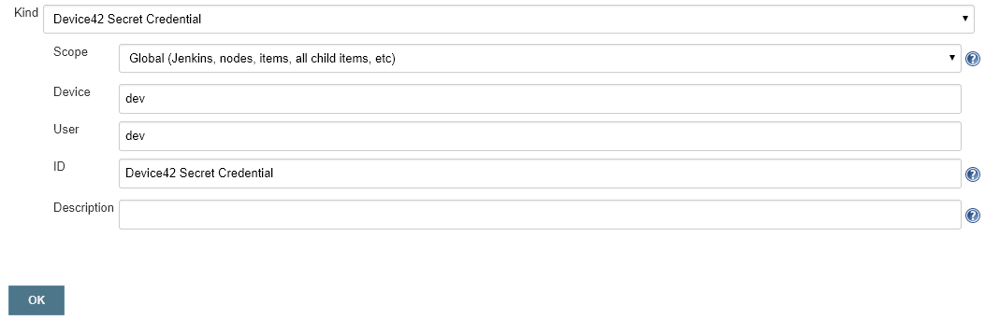

# device42-credentials-plugin
This Device42 plugin securely provides credentials that are stored in Device42 to Jenkins jobs.  

## Installation

### From Source

To build the plugin from source, Maven is required. Build it like this:

```bash
git clone {repo}
cd device42-jenkins-credentials-plugin
mvn install -DskipTests
```
### From Binaries

As another option, you can use the latest .hpi found under the binaries folder.

### Install in Jenkins

When you have the .hpi file, log into Jenkins as an administrator. Then go to **Jenkins** -> **Manage Jenkins** -> **Manage Plugins** -> 	**Advanced**. 
In the **Upload Plugin** section, browse for the .hpi and upload it to Jenkins:


After installing the plugin, restart Jenkins:


## Usage

After installing the plugin and restarting Jenkins, you are ready to start.

### Device42 Login Credential

The first step is to store the credential required for Jenkins to connect to Device42. Click the **Credentials** tab.

 Define the credential as a standard "Username with password" credential. In the example below, the credentials are a Device42 host and its API key: 

* **Username** is admin. The host must already be defined as a host in Device42 policy. 
* **Password** is the password for that host. (default password: adm!nd42)  


### Global Configuration

A global configuration allows any job to use the configuration, unless a folder-level configuration overrides the global configuration. Click the **Global Credentials** tab.

 Define the Device42 Account and Appliance URL to use. 


 
 

### Device42 Secret Definition

The secrets that you want to obtain from Device42 must be defined explicitly. Use the **Device42Secret** tab to define secrets. Define them as credentials of kind "Device42 Secret Credential". 




### Usage from a Build Execute Nodes

To bind to Device42 secrets, use the option "Use secret text(s) or file(s)" in the "Build Environment" section of a Freestyle project.


Secrets are injected as environment variables to the build steps of the project. 


### Usage from a Jenkins Freestyle Project

To bind to Device42 secrets, use the option "Launch agent agents via SSH" in the "Build Environment" section of a Add Node .


